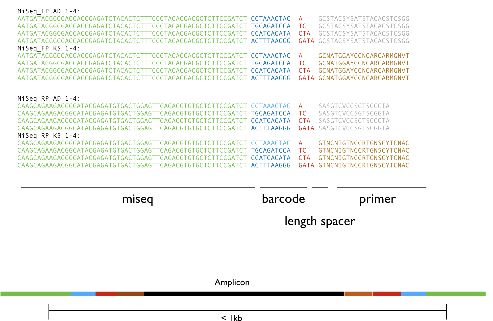

## Primer Design Logic

paired-end-debarcoder is designed with a particular set of barcoded primers in mind. Initially inspired by [Fadrosh et al](https://microbiomejournal.biomedcentral.com/articles/10.1186/2049-2618-2-6),
we wanted to be able to demultiplex samples beyond what is typically available in commercial barcoding kits. The basic logic is 
straightforward - we place a barcode between the Illumina sequencing primer sequence and the degenerate barcode used for PCR
amplification of your target. The goal is to create a an amplicon that looks like the schematic on the bottom of this image:


Note that there are the following elements to the amplicon sequence:

  1. Green: The Illumina P5 Sequence (including the sequencing primer sequence)
  2. Blue: The Barcode Sequence. (Forward) Used for idendtification.
  3. Red: The Length Spacer. Added to reduce the "strobe" effect of amplicons on the Illumina optics.
  4. Brown: The Degenerate Primer (Forward)
  5. Black: The Amplicon
  6. Brown: The Degenrate Primer (Reverse)
  7. Red: The Length Spacer
  8. Blue: The Barcode Sequence (Reverse)
  9. Green: The Illumina p7 Sequence (including the sequencing primer sequence)

In our system we use barcodes from both reads that are combined together to create the unique barcode. If you only use the barcode from
the forward read, this package is probably not for you.

## Single-End Versus Dual-End Barcodes

Barcodes can be created on the forward read so why would you even need/want to use dual-barcode primers? Doesn't this add a layer of
complexity that can potentially cause mistakes at the experimental or bioinformatic analysis level? The answer comes down to cost.

We tried a system where we were using 96 barcoded primers for a given target. We wanted to expand the number of targets we could multiplex on
a run and we also were interested in using many more targets for amplification. Lets generously assume a primer cost of approximately $10 per
primer (<60bp). A plate of forward primers  will then cost 96 * 10 = $960.  However, if we array forward and reverse primer across the rows
and columns of a 96-well plate we can barcode the same samples with 8 + 12 = 20 primers for a cost of $200, a ~5X cost savings.  This
cost savings is more exaggerated if you wish to go to 384-wells ($3,840 vs (16+24) * 10  = $400) where you get near 10x savings. 

Depending upon your project this cost savings may not be worth the difficulty or may be small relative to your sequencing costs in which case
this strategy is not for you. However, we have found that if you are willing to use all three potential places to index (Forward read, Reverse Read,
Index Read) that you can bring drive down your primer costs and that is worthwhile to do so.

## Primer Design

To design our primers we begin with our degenerate primers and then add the requisite forward and reverse sequences. Here is an example
for primer design targeting Adenylation Domain and Ketosynthase domains primers where the Forward primers are on the top and the reverse
primers are on the bottom.



## The Mapping File

Several functions in `paired-end-debarcoder` including `demutliplexfastq`, `demultiplexfasta`, and `demultiplexfasta-parallel` require
a Mapping file that will tell the program what barcode belongs to what sample. This example, taken from the test data, shows only the first 8 (required columns) of the mapping file.


## Sample Usage Within a Makefile

Use the demultiplex fastq file to process paired end FQs and split them into per-sample fastq files in the `fastq` 
directory. 

```makefile
	fq1 = sample1_F.fq.gz
	fq2 = sample1_R.fq.gz

	# debarcode the reads in your fastq files to the fastqs directory
	demultiplex:
		demultiplexfastq \
		  --forward_fastq <(zcat $(fq1)) \
		  --reverse_fastq <(zcat $(fq2)) \
		  --barcodefile $(mappingfile) \
		  --barcodelength 16 \
		  --max_mismatches 0 \
		  --outdirectory fastqs \
		  --logfile logfile_primer.txt
		
```

Take the paired-end fastq files and process them by concatenating them together and prepending your sample name to the output fasta file.

```makefile
	# define the jobs to be processed
	fqs = $(wildcard fastqs/*_F.fq)
	processdir = processed
	combined      = $(patsubst fastqs/%_F.fq, $(processdir)/%_combined.fq, $(fqs))

	# use fastqconcat to combine each set of forward/reverse reads
	$(combined):$(processdir)/%_combined.fq: fastqs/%_F.fq
		mkdir -p $(processdir)
		$(eval samname := $(patsubst %_F.fq, %, $(notdir $<)))
		fastqconcat \
		--forward_fastq <(seqtk trimfq fastqs/$(samname)_F.fq) \
		--reverse_fastq <(seqtk trimfq fastqs/$(samname)_R.fq) \
		--outfile $@ \
		--discard \
		--keep_left 240 \
		--keep_right 175 \
		--revcomp \
		--spacer \
		--spacercharacters N \
		--samplename $(samname) 

	# note: $(eval ....) allow s you to assign variables within task blocks in make/
	# note: $(notdir ....) gives the filename of a PATH

	combine: $(combined)
```